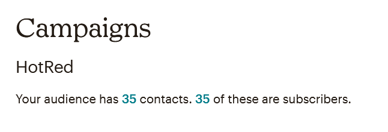
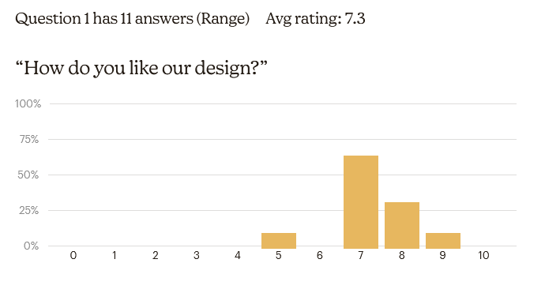
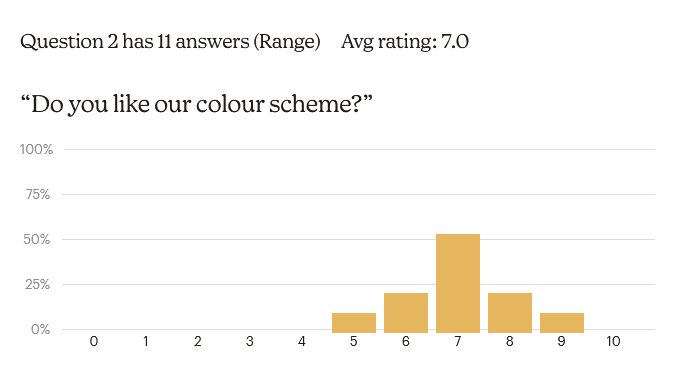

# Mailchimp Opdracht

Het doel van de opdracht was om een geautomatiseerd bericht te sturen met het gebruik van mailchimp. Hierdoor kunnen we ook een survey afleggen en zien waar mensen naar kijken.

## Start van de opdracht

In het begin van de opdracht zijn we begonnen door te overleggen. Hier hebben we besproken wie wat zal doen. Daarna hebben we rustig aan ons eigen delen gewerkt en af en to een meeting gehad. 

<!--  -->

## Mail

Er werd naar 35 mensen een mail gestuurd.

Deze mail was gestyled zodat het een beetje leek op de site. Het bevatte ook een afbeelding van de landings pagina. Dit diende als voorbeeld van de pagina.
Er was ook een survey meegestuurd om een te zien wat mensen van de landingspagina vonden.

## Data

Er zijn 11 mensen die een antwoord gestuurd hebben voor deze survey.

Hieronder zal je 2 grafieken vinden voor de 2 verplichte vragen.

Zoals je kan zien is het gemiddelde op beide vragen een 7.

De derde vraag werd maar door **6** van de deelnemers beantwoord. Maar we zijn zeker tevreden met de antwoorden dat we op deze vraag gekregen hebben.
